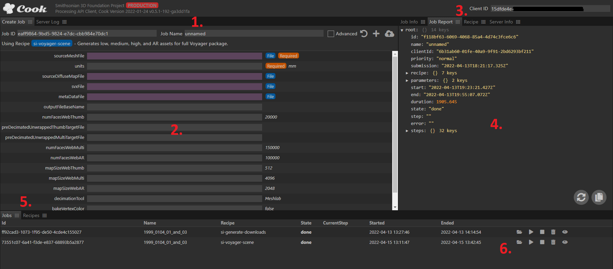
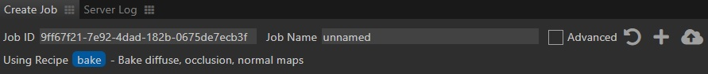
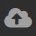
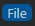
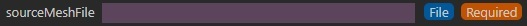
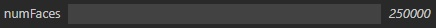

The easiest way to kick off a Cook job is through the web UI.

[Launch a Cook server instance](../getting-started/) and then connect to the UI via your preferred web browser at the port specified in your server.json config file.

The template port is 8000, so in that case the URI for a default local installation would be http://localhost:8000/, but this could vary based on your configuration and
web server root.

## Interface Components

---

#### 1. Create Job Tab Header

The Create Job tab is where you will configure and upload a new Cook job.

The header has the following fields/functions:

**Job ID** - Unique ID that is automatically generated when the window or recipe is reloaded. Most of the time this can be ignored, but every job ID must be unique to successfully start
 so if you want to launch an additional job without reloading you will need to edit this ID to make it unique.

**Job Name** - Name that will show up in the Job tab (5.) to help identify specific jobs when there are many.

**Advanced** - Checkbox that shows/hides less common parameters for the currently loaded recipe.

 **Initialize job from recipe** - Loads the currently selected recipe into the main Job Tab window (2.).

 **Create job on server** - Creates a job without uploading assets. Useful if you are transferring assets in some other way.

 **Create job on server, upload files** - Creates a job and uploads assets to the server. Best way to create a job in most cases.

**Using Recipe** - At the bottom of the header the currently loaded recipe name and description is displayed.  
  
---

#### 2. Create Job Tab Body

The body of the Create Job tab displays all of the inputs and options for the currently selected recipe.

**File Inputs** - File inputs can be identified by a purple text box and  decorator. You can set these inputs by drag-and-dropping files directly to the input box.
Example: 

**Text Inputs** - Text inputs will display the parameter name on the left and default value on the right of the text input box. Type the desired value into the text box or leave it blank to use the default.
Example: 

**Required** - Any parameter with the  decorator must have a value for the recipe job to be successfully created.

---

#### 3. Client ID

**IMPORTANT** - The Client ID field **must** be set and match an entry in your clients.json config or Cook **will not** process any jobs.

---

#### 4. Job and Recipe Info

This section contains several tabs of information described below.

**Job Info Tab** - Provides high-level information on the active job, or job currently selected in the Jobs tab (5.). This includes info like the recipe being run, start and end times, and job status.

**Job Report Tab** - Provides low-level information on the active job, or job currently selected in the Jobs tab (5.). It will update in real-time as a job runs and display log information on each recipe
step as it becomes available.

**Recipe Tab** - Displays the content of the currently selected recipe (parameters and task steps) in an expandable tree format.

**Server Info Tab** - Displays high-level info on jobs and users currently active on the Cook server.

---

#### 5. Jobs / Recipes Tabs

These tabs allow you to select a recipe for a new Cook job and monitor any active jobs.

**Recipes** - Lists the ID, name, version, and description of each available recipe. Select a recipe entry here and click the "Initialize Job" button (1.) to load it to the Job Tab (2.).

**Jobs** - Lists the ID, name, recipe, and state for all jobs on the server. Current step and start/end time may also be provided if the job is in a relevant state - this attributes will also update as a job runs. 
This tab also provides job-level controls, described in (6.) below.

---
	
#### 6. Job-level Controls

 **Start job** - Kicks off the Cook job. The input assets must exist on the server to succeed.

 **Cancel job** - Stops a currently running Cook job.

 **Delete job and files** - Removes a Cook job and all associated files from the server.

 **Copy WebDAV folder path to clipboard** - Copys a link to the job asset folder to your clipboard for easy access to output.	